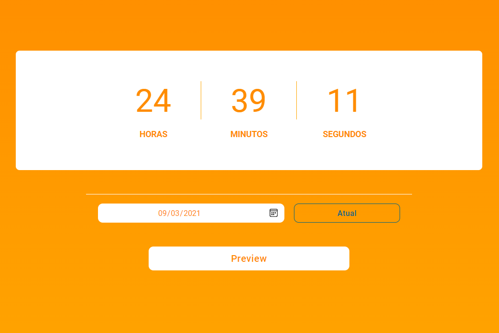

# countdown-timer
A countdown timer that takes the date passed by the user and shows how much time is left to finish.

# Technologies
In this project I used HTML5, CSS3 and JavaScript

## Result

> ### See and interact with the application [here](https://binary-to-decimal-lusk1nha.vercel.app/) 

